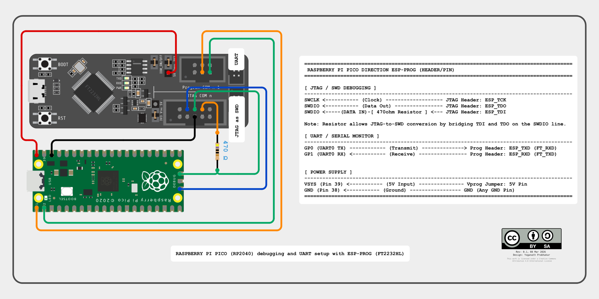

# Exploration Log: RP2040 Debugging via ESP-PROG

> **📌 Note on Project Status:** This repository is currently documenting an active debugging process. Significant issues regarding SWD stability and OpenOCD core-handling are being addressed. This log serves as a progress tracker and will be finalized once a 100% stable connection is achieved.

### ⚠️ Disclaimer

**Use at your own risk.** This documentation involves hardware wiring and power distribution.

* **Voltage Check:** Ensure your ESP-PROG is set to the correct logic level (3.3V) for the RP2040 signal pins.
* **Power Loops:** Do not connect both the Pico USB and the ESP-PROG 5V line simultaneously unless you have implemented power-path protection, as this can cause back-feeding and hardware damage.
* **Wiring:** Double-check all Ground (GND) connections before applying power.

---

### Current Debugging Focus: Signal Stability & GDB Integration

I am currently investigating why the connection drops with a `DAPABORT` error after 10–20 seconds, specifically when attempting to transition from flashing to active debugging.

* **Working:** I am successfully able to flash the `.elf` binary through OpenOCD using the manual flash sequence. The hardware link is sufficient for data transfer.
* **Issues:** Unable to use `gdb-multiarch` for live debugging. The session crashes almost immediately upon attachment or when the `continue` command is issued.

---

### 1. SDK Setup

The official script automates the installation of the `arm-none-eabi-gcc` cross-compiler and the Pico SDK.

```bash
wget https://raw.githubusercontent.com/raspberrypi/pico-setup/master/pico_setup.sh
chmod +x pico_setup.sh
./pico_setup.sh
```

### 2. Workspace & Recompilation

After the setup script runs, the directory layout should look like this. I am working inside `~/mcu/pico`:

```bash
yogan@u24:~/mcu/pico$ ls
debugprobe  openocd  pico-examples  pico-extras  pico-playground  pico-sdk  pico_setup.sh  picotool
```

**Initial Build:**
The `pico_setup.sh` script compiles all examples initially; you can find the pre-built binaries in the respective `build_pico/hello_world/serial` folders.

**Manual Recompilation:**
When you modify the code, you need to re-trigger the build manually:

```bash
cd ~/mcu/pico/pico-examples/build_pico/hello_world/serial
make -j$(nproc)
```

* **`make`**: Invokes the build system to compile source code into binaries.
* **`-j$(nproc)`**: Uses all available CPU cores to speed up the compilation.

### 3. Binary Selection (UF2 vs ELF)

* **`.uf2`**: A "USB Flashing Format" used by the Pico's internal bootloader (BOOTSEL mode).
* **`.elf`**: An "Executable and Linkable Format" containing **Debug Symbols**. These allow GDB to map memory addresses back to your C code.
* **Evolution**: Once the wiring is done, we can stop using the USB boot button entirely and push the `.elf` through the debugger wires.
* **My Design Choice**: I chose to use **only one USB port** on my laptop instead of two. By routing both **SWD** and **UART** through the ESP-PROG, I can power, flash, and monitor the Pico with a single cable.

### 4. Hardware Connection

Connect the devices as per the diagram below.



* **470Ω Resistor**: Essential. It allows the unidirectional TDI and TDO pins on the FTDI chip to act as a single bidirectional SWDIO pin for the Pico.

### 5. UDEV Rules for FT2232

Linux won't talk to the ESP-PROG without permissions.

```bash
# Create the file: /etc/udev/rules.d/60-openocd.rules
ATTRS{idVendor}=="0403", ATTRS{idProduct}=="6010", MODE="660", GROUP="plugdev", TAG+="uaccess"
```

* **`idVendor/Product`**: Identifies the FT2232HL (0403:6010).
* **`GROUP="plugdev"`**: Allows users in the `plugdev` group access without `sudo`.
* **Reload Rules**: `sudo udevadm control --reload-rules && sudo udevadm trigger`

### 6. OpenOCD Configuration (`openocd/esp-prog.cfg`)

I am using this configuration for SWD transport. **Note:** I found that an adapter speed of **1000** is the "sweet spot"; **2000** is often too fast for loose jumper wires, leading to `DAPABORT` errors.

```tcl
adapter driver ftdi
ftdi vid_pid 0x0403 0x6010
ftdi channel 0
adapter speed 1000

# Standard layout for FT2232H SWD
ftdi layout_init 0x0008 0x000b
ftdi layout_signal nTRST -data 0x0010
ftdi layout_signal nSRST -data 0x0020

# FIX: Define the SWD_EN signal (essential for stable transport)
ftdi layout_signal SWD_EN -data 0

transport select swd
source [find target/rp2040.cfg]
```

* **`transport select swd`**: Switches the protocol from JTAG to ARM's 2-wire Serial Wire Debug.

### 7. Serial Monitor (Minicom)

Since the ESP-PROG provides two interfaces, **Interface 1** is our UART (usually appearing as `/dev/ttyUSB1`).

```bash
sudo apt install minicom
minicom -D /dev/ttyUSB1 -b 115200 
```

* **`-D /dev/ttyUSB1`**: Targets the UART channel of the ESP-PROG.
* **`-b 115200`**: Sets the Baud rate (communication speed).

### 8. Launching OpenOCD and GDB

Currently, OpenOCD serves primarily as the flash bridge since GDB integration is still under debug.

**Terminal 1 (OpenOCD):**

```bash
openocd -f openocd/esp-prog.cfg
```

**Terminal 2 (GDB):**

```gdb
gdb-multiarch ~/mcu/pico/pico-examples/build/hello_world/serial/hello_serial.elf
(gdb) target extended-remote :3333
(gdb) monitor reset init
```

* **`target extended-remote :3333`**: Connects GDB to the OpenOCD server.
* **`monitor:`** Sends the command through GDB to OpenOCD.
* **`reset init:`** Triggers a hardware reset and prepares the RP2040 for a fresh debug session.

---

### 9. Direct ELF Download & Automation

#### 9.1 GDB Method (Reference)

Inside GDB, use these commands to flash and run:

```gdb
(gdb) load
(gdb) monitor reset init
(gdb) continue
```

* **`load`**: Pumps the `.elf` binary into the Pico’s flash memory via the SWD link.

#### 9.2 The "CX" Bug & Stable Workaround

I am currently bypassing the high-level `program` helper script in OpenOCD 0.12.0+ because it incorrectly parses dual-core arguments for the RP2040.

**The Buggy Command (Avoid):**
`Error: args[i] option value ('CX') is not valid`

```bash
openocd -f ~/mcu/pico/openocd/esp-prog.cfg -c "program hello_serial.elf verify reset exit"
```

**The Stable Command:**
This manual sequence bypasses the helper script to ensure a successful flash and clean exit.

```bash
openocd -f ~/mcu/pico/openocd/esp-prog.cfg -c "init; reset halt; flash write_image erase hello_serial.elf; verify_image hello_serial.elf; reset run; exit"
```

---

### 🖇️ Acknowledgments & References

* **Primary Reference:** This guide is an optimized Linux adaptation of the [RP2040: Quick setup guide for Win10 and FT2232H](https://www.hackster.io/NYH-workshop/rp2040-quick-setup-guide-for-win10-and-ft2232h-bcab1b) by **NYH Workshop**.

---

### Licensing

To maintain legal and ethical compatibility with the original work:

* **Code & Configs:** Licensed under the [GNU General Public License v3.0 (GPLv3)](https://www.gnu.org/licenses/gpl-3.0.html).
* **Documentation & Images:** Licensed under [Creative Commons Attribution-ShareAlike 4.0 International (CC BY-SA 4.0)](https://creativecommons.org/licenses/by-sa/4.0/).

**© 2026 Yoganath Prabhakar**
